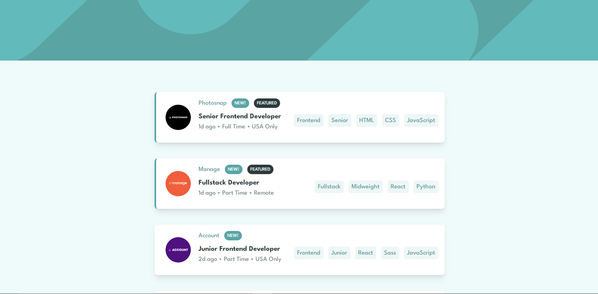
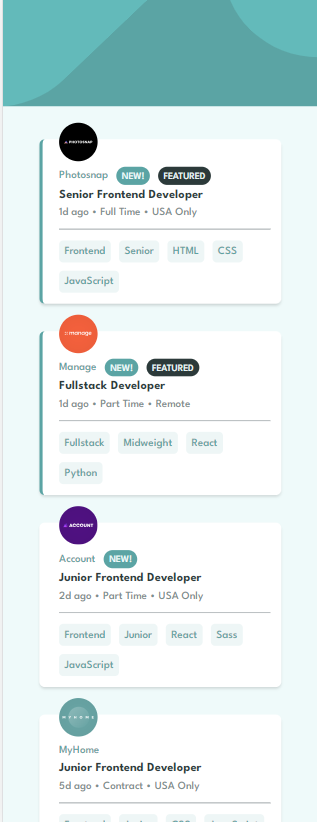

# Frontend Mentor - Job listings with filtering solution

This is a solution to the [Job listings with filtering challenge on Frontend Mentor](https://www.frontendmentor.io/challenges/job-listings-with-filtering-ivstIPCt). Frontend Mentor challenges help you improve your coding skills by building realistic projects.

## Table of contents

- [Overview](#overview)
  - [The challenge](#the-challenge)
  - [Screenshot](#screenshot)
  - [Links](#links)
- [My process](#my-process)
  - [Built with](#built-with)
  - [What I learned](#what-i-learned)
  - [Continued development](#continued-development)
- [Author](#author)

## Overview

This was a great exercise for working with filtering. Alot of interactivity was going on. This app is like a job page where you see all the jobs. And by clicking on right side elements (on big screens) and bottom side element (on small screens) you can filter the jobs.

### The challenge

Users should be able to:

- View the optimal layout for the site depending on their device's screen size
- See hover states for all interactive elements on the page
- Filter job listings based on the categories

### Screenshot

Below are the screenshots of app.

### Desktop



### Mobile



### Links

- Solution URL: [Github repo URL](https://github.com/AbroShahzeb/job-listing-app)
- Live Site URL: [Hosted app URL](https://abroshahzeb.github.io/job-listing-app/)

## My process

### Built with

- Semantic HTML5 markup
- Tailwind css
- Mobile-first workflow
- [React](https://reactjs.org/) - JS library

### What I learned

This was an amazing exercise to test my data structures. I had to manipulate the filters array, which was quite complex (atleast I thought so) but I managed to do it.

I am really proud of JavaScript function show below as it handled all the filtering work.

```js
const applyFilters = () => {
  const filteredJobs = initialJobs.filter((job) => {
    const roleFilter = !filters[0].role || job.role === filters[0].role;
    const levelFilter = !filters[0].level || job.level === filters[0].level;
    const languageFilter =
      filters[0].languages.length === 0 ||
      filters[0].languages.every((lang) => job.languages.includes(lang));
    const toolsFilter =
      filters[0].tools.length === 0 ||
      filters[0].tools.every((tool) => job.tools.includes(tool));

    return roleFilter && levelFilter && languageFilter && toolsFilter;
  });

  setJobs(filteredJobs);
};
```

### Continued development

I will be learning more about array and their manipulations, because with those you can accomplish wonders.

## Author

**Shahzeb Abro - A passionate Web Developer**

- Frontend Mentor - [Shahzeb Abro](https://www.frontendmentor.io/profile/AbroShahzeb)
